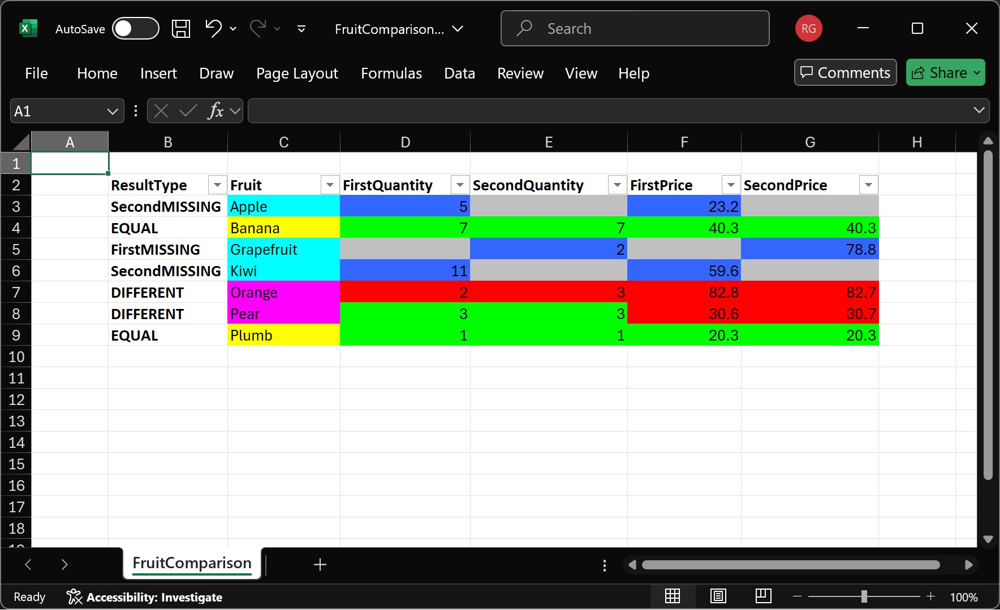

Bean Compare
============

- [Overview](#overview)
- [More Info](#more-info)
- [Building](#building)

### Overview

Given this CSV
```
Plumb,1,20.3
Orange,2,82.8
Kiwi,11, 59.6
Apple,5,23.2
Banana,7,40.3
Pear,3,30.6
```

and this CSV
```
Orange,3,82.7
Pear,3,30.7
Banana,7,40.3
Grapefruit,2,78.8
Plumb,1,20.3
```

Bean Compare will produce this comparison


Bean Compare started a utility for comparing Java Beans, hence the name. It then included
Collections, Arrays and Maps as types it can compare. It now also supports data from
[Dido](https://github.com/robjg/dido) which allows it to compare Database tables, CSV files, simple JSON
and any other type of Dido Data.

### More Info

See [Getting Started](docs/GETTING-STARTED.md)

See [The Reference](docs/reference/README.md)

### Building

See [Building](BUILDING.md)

Modules:

[beancmpr-core](beancmpr-core) Compare Beans, Collections, Arrays and Maps.

[beancmpr-dido](beancmpr-dido) Compare Generic Data.

[beancmpr-poi](beancmpr-poi) Produce results in Excel.

