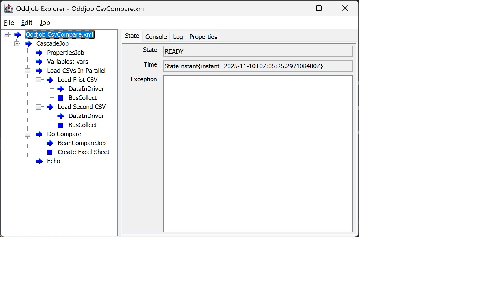
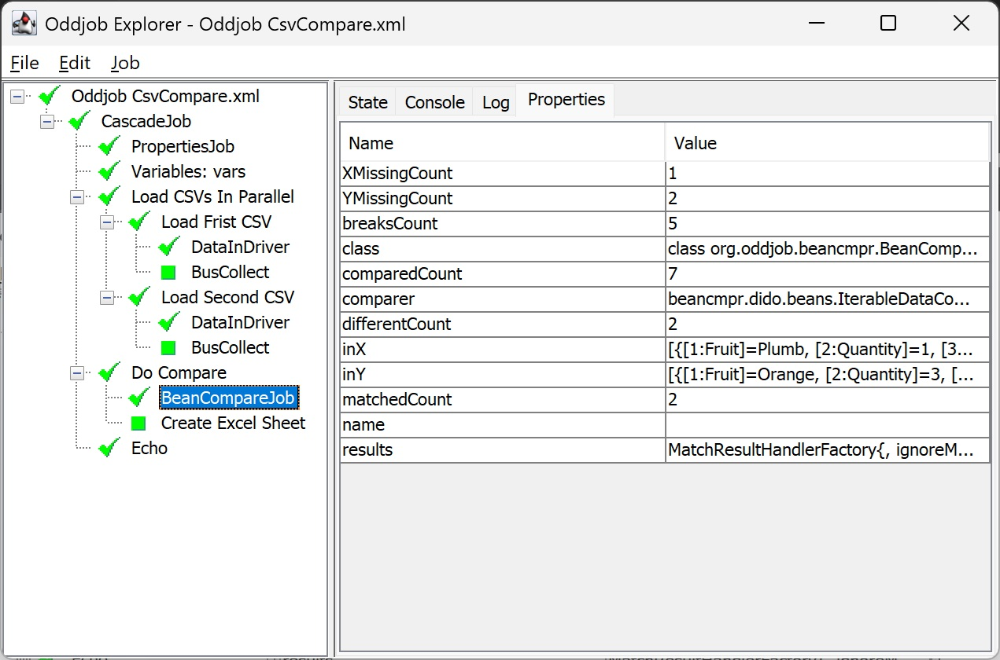

Getting Started
===============

Beancmpr requires Java 21. It is in Maven, however it is intended to be used with
[Oddjob](https://github.com/robjg/oddjob) and so requires a few dependencies to launch.

For an example POM needed to launch Beancmpr in Oddjob see [The Examples POM](../beancmpr-examples/pom.xml).

The pom also contains a target to run the example comparison from the [README](../README.md).

Assuming you have Maven installed, clone this repo, and from a command prompt change directory to 
`beancmpr-examples` and run 
```shell
mvn exec:exec@example1 -P examples 
```
You should see
```
Compared: 7
Matched: 2
Different: 2
Missing from First: 1
Missing from Second: 2
Created Full Comparison in C:\Users\rob\projects\beancmpr\beancmpr-examples\FruitComparison.xlsx
```
Oddjob is configured using XML. This is the configuration used to run this example:
```xml
<?xml version="1.0" encoding="UTF-8" standalone="no"?>
<oddjob>
    <job>
        <cascade>
            <jobs>
                <properties>
                    <values>
                        <file file="." key="work.dir"/>
                        <file file="${work.dir}/FruitComparison.xlsx" key="comparison.file"/>
                        <file file="./data" key="data.dir"/>
                        <file file="${data.dir}/Fruit_1.csv" key="file.first"/>
                        <file file="${data.dir}/Fruit_2.csv" key="file.second"/>
                    </values>
                </properties>
                <variables id="vars">
                    <schema>
                        <dido:schema xmlns:dido="oddjob:dido">
                            <of>
                                <dido:field name="Fruit" type="java.lang.String"/>
                                <dido:field name="Quantity" type="int"/>
                                <dido:field name="Price" type="double"/>
                            </of>
                        </dido:schema>
                    </schema>
                </variables>
                <parallel name="Load CSVs In Parallel">
                    <jobs>
                        <bus:bus name="Load Frist CSV" xmlns:bus="oddjob:beanbus">
                            <of>
                                <dido:data-in xmlns:dido="oddjob:dido">
                                    <how>
                                        <dido:csv>
                                            <schema>
                                                <value value="${vars.schema}"/>
                                            </schema>
                                        </dido:csv>
                                    </how>
                                    <from>
                                        <file file="${file.first}"/>
                                    </from>
                                </dido:data-in>
                                <bus:collect id="captureFirst"/>
                            </of>
                        </bus:bus>
                        <bus:bus name="Load Second CSV" xmlns:bus="oddjob:beanbus">
                            <of>
                                <dido:data-in xmlns:dido="oddjob:dido">
                                    <how>
                                        <dido:csv>
                                            <schema>
                                                <value value="${vars.schema}"/>
                                            </schema>
                                        </dido:csv>
                                    </how>
                                    <from>
                                        <file file="${file.second}"/>
                                    </from>
                                </dido:data-in>
                                <bus:collect id="captureSecond"/>
                            </of>
                        </bus:bus>
                    </jobs>
                </parallel>
                <bus:bus name="Do Compare" xmlns:bus="oddjob:beanbus">
                    <of>
                        <beancmpr:compare id="compare" xmlns:beancmpr="oddjob:beancmpr">
                            <inX>
                                <value value="${captureFirst.list}"/>
                            </inX>
                            <inY>
                                <value value="${captureSecond.list}"/>
                            </inY>
                            <comparer>
                                <didocmpr:collection-comparer keys="Fruit" values="Quantity,Price" xmlns:didocmpr="oddjob:didocmpr"/>
                            </comparer>
                            <results>
                                <beancmpr:match-results/>
                            </results>
                        </beancmpr:compare>
                        <beancmpr:poi-results autoFilter="true" autoWidth="true" firstColumn="2" firstRow="2" name="Create Excel Sheet" sheetName="FruitComparison" xPrefix="First" yPrefix="Second" xmlns:beancmpr="oddjob:beancmpr">
                            <workbook>
                                <dido-poi:workbook xmlns:dido-poi="oddjob:dido:poi">
                                    <output>
                                        <file file="${comparison.file}"/>
                                    </output>
                                </dido-poi:workbook>
                            </workbook>
                        </beancmpr:poi-results>
                    </of>
                </bus:bus>
                <echo><![CDATA[Compared: ${compare.comparedCount}
Matched: ${compare.matchedCount}
Different: ${compare.differentCount}
Missing from First: ${compare.XMissingCount}
Missing from Second: ${compare.YMissingCount}
Created Full Comparison in ${comparison.file}]]></echo>
            </jobs>
        </cascade>
    </job>
</oddjob>
```

This will appear quite confusing at first. It might be easier to view it using Oddob's UI, 
Oddjob Explorer which can be done by running
```shell
exec:exec@oddjob-explorer-example1 -P examples
```
Expand all the jobs in the tree and you will see:



We can now see all the stages of the comparison. They are:

- [Oddjob](https://github.com/robjg/oddjob/blob/master/docs/reference/org/oddjob/Oddjob.md): The job that loaded the configuration thus creating all the other jobs.
  - [CascadeJob](https://github.com/robjg/oddjob/blob/master/docs/reference/org/oddjob/state/CascadeJob.md): A job that will run the next of its children after the previous completes
    - [PropertiesJob](https://github.com/robjg/oddjob/blob/master/docs/reference/org/oddjob/values/properties/PropertiesJob.md): A job that defines properties such as the file names for other jobs to use.
    - [Variables](https://github.com/robjg/oddjob/blob/master/docs/reference/org/oddjob/values/VariablesJob.md): A job that defines reusable definitions for other jobs to use. Here we define the [schema](https://github.com/robjg/dido/blob/master/docs/reference/dido/oddjob/schema/SchemaBean.md) for our data.
    - [Load CSVs in Parallel](https://github.com/robjg/oddjob/blob/master/docs/reference/org/oddjob/jobs/structural/ParallelJob.md): A job that runs its child jobs (The 2 CSV loads) at the same time. 
      - [Load First CSV](https://github.com/robjg/oddjob/blob/master/docs/reference/org/oddjob/beanbus/bus/BasicBusService.md): Defines a data pipeline for reading the first CSV file.
        - [DataInDriver](https://github.com/robjg/dido/blob/master/docs/reference/dido/oddjob/beanbus/DataInDriver.md): Something that can load data in different formats. Here it's configured for [CSV](https://github.com/robjg/dido/blob/master/docs/reference/dido/csv/CsvDido.md).
        - [BusCollect](https://github.com/robjg/oddjob/blob/master/docs/reference/org/oddjob/beanbus/destinations/BusCollect.md): Collect the data.
      - Load Second CSV: As above, but for the second file.
        - DataInDriver: As above, but load the second file from csv.
        - BusCollect: As above, but collect the second file's data.
    - [Do Compare](https://github.com/robjg/oddjob/blob/master/docs/reference/org/oddjob/beanbus/bus/BasicBusService.md): Define a data
    pipeline that will pipe the results of the comparison into something that will display the results.
      - [BeanCompareJob](https://github.com/robjg/beancmpr/blob/master/docs/reference/org/oddjob/beancmpr/BeanCompareJob.md): Does the comparison using a comparer and sends results to the next component in the pipeline. 
      The comparer is a [Collection Comparer for Dido Data](https://github.com/robjg/beancmpr/blob/master/docs/reference/beancmpr/dido/beans/IterableDataComparerType.md). 
      The results produced are first [Processed](https://github.com/robjg/beancmpr/blob/master/docs/reference/org/oddjob/beancmpr/results/MatchResultHandlerFactory.md) before
      they are sent onwards.
      - [Create Excel Sheet](https://github.com/robjg/beancmpr/blob/master/docs/reference/beancmpr/poi/PoiMatchResultsService.md): Takes the 
      results and create an Excel sheet.
    - [Echo](https://github.com/robjg/oddjob/blob/master/docs/reference/org/oddjob/jobs/EchoJob.md): Display a summary of the comparison by using
    properties of the comparison job.

Run the root job node from the 'Job' Menu and you will see the jobs run and hopefully complete:



Here we've navigated to the Comparison Job so you can see properties of the comparison that
get written the console by the final `echo` task.

And that's a very quick guid to getting started with Beancmpr.


